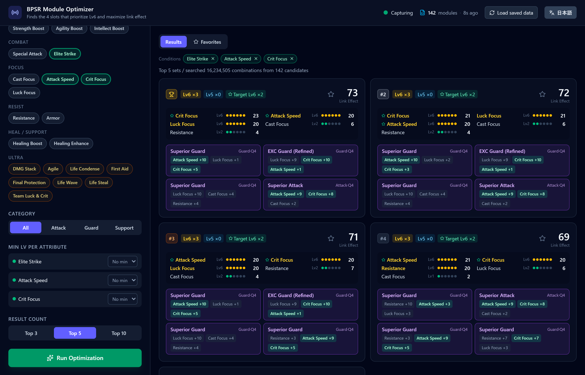
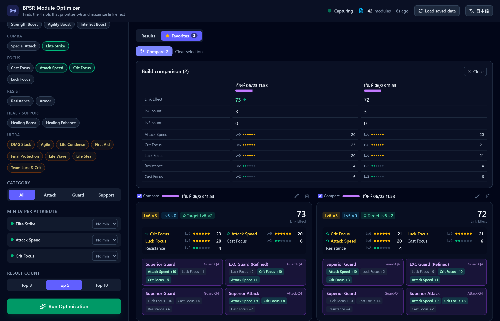

# bpsr-module-optimizer

**[日本語](./README.md) | [English](./README.en.md)**

**A module optimizer for Blue Protocol: Star Resonance (Windows only)**

[](https://github.com/Rererr/bpsr-module-optimizer/releases)
[](./LICENSE)
[](https://github.com/Rererr/bpsr-module-optimizer/releases)

[](https://discord.gg/exU3gPBx3)

From the modules you own, it brute-forces every combination of **4 or 5 slots** to find the one that maximizes the attributes you are aiming for. Your owned modules are read automatically from the game's network traffic, so there is no manual entry. **It never sends any data to external servers.**

<p align="center">
  
  <br><sub>Brute-forces the best 4-slot build for your target attributes (here: 142 candidates, over 16 million combinations searched)</sub>
</p>

> A personal-use helper tool. It modifies none of the game's files, memory, or network traffic. Use it at your own risk, and check the terms of service of each platform.

## Features

- **Full 4/5-slot search** — Switch the slot count between 4 and 5. Compares every combination for the chosen slot count from your owned modules and presents the best set.
- **Target / excluded attributes** — Click to pick the attribute you want to grow (click again to mark it as excluded).
- **Per-attribute minimum level** — Narrow results with conditions like "this attribute must be at least Lv5."
- **Category filter** — Filter by module type: Attack / Guard / Support.
- **Top 3 / 5 / 10 view** — Lists each set's Lv6 count, Lv5 count, full attribute-level breakdown, and link effect (the sum of all attribute values).
- **Presets** — Name and save frequently used search conditions and recall them with one click.
- **Favorite builds** — Save setups you like with a ★. They can be named and managed, and multiple builds can be compared side by side.
- **Build comparison** — Pick 2–3 from your favorites to display the attribute differences in parallel.
- **Condition summary** — Shows the current search conditions as tags. Remove a condition on the spot via the × on a tag and re-search.
- **Live auto-fetch & auto-research** — When module information updates, it loads automatically, and if conditions are already set, it re-runs the search automatically.
- **Automatic state restore** — Saves the fetched modules and your last search conditions, restoring them on the next launch.
- **JSON dump loading** — For environments where traffic cannot be captured, it can also load from `owned_modules.json`.
- **Japanese / English UI** — Switch between Japanese and English with the header toggle (no restart needed).

## Screenshots

<p align="center">
  
  <br><sub>Place multiple saved favorite builds side by side and compare their per-attribute levels</sub>
</p>

## Installation

1. Download the latest NSIS installer (`.exe`) from [Releases](https://github.com/Rererr/bpsr-module-optimizer/releases).
2. Run the installer to install the app.
3. Launch the app. Live fetching requires administrator privileges, so allow the UAC prompt that appears at startup (it self-elevates automatically).

### Requirements

- Windows 10 / 11 (x64)
- Administrator privileges for live fetching (required to load the WinDivert kernel driver)

Live fetching reads packets using [WinDivert](https://www.reqrypt.org/windivert.html). `WinDivert.dll` and `WinDivert64.sys` are bundled with the installer and placed in the same folder as the app.

## Usage

1. Launch the app (it requests administrator privileges via UAC, just like the game).
2. **Change maps or re-login** in-game, and your owned modules load automatically.
3. On the left, pick the **attribute you want to grow**, and set a minimum Lv, category, and result count as needed.
4. Press "Run optimization," and the top sets are shown as cards.
5. Save sets you like to **Favorites** with a ★. Saving frequently used conditions as **Presets** is convenient.

> The fetched modules and search conditions are saved automatically, so you can check the results right away on the next launch.

## Safety & Privacy

Answers to common concerns about this tool.

### Will I get banned for using this?

**It modifies none of the game's files, memory, or network traffic.** It merely passively observes incoming packets and reconstructs your owned-module information — it performs no injection, patching, or automation against the game client.

That said, this is an **unofficial, individually-developed tool**, and the possibility that it stops being tolerated due to a future change in the operator's terms cannot be ruled out. **The final decision to use it is at your own risk.**

### Is it a virus? My antivirus flagged it

**It is a false positive.** It bundles the [WinDivert](https://www.reqrypt.org/windivert.html) driver, which captures packets at the kernel level, so some antivirus software may warn about it as a "network monitoring tool."

For example, on VirusTotal, Kaspersky may report `Not-a-virus:HEUR:RiskTool.Multi.WinDivert.gen`. This classifies the bundled WinDivert driver as "riskware" (a network tool) — it is **not malware** (note the `Not-a-virus` prefix).

What to do:
- Add the WinDivert driver (`WinDivert.dll`, `WinDivert64.sys`) and the install folder to your antivirus exclusions.
- If you are worried, you can review the [source code](https://github.com/Rererr/bpsr-module-optimizer) and [build it yourself](#development--building) (GPL-3.0).

### Windows SmartScreen shows "Windows protected your PC"

Newly released apps can trigger a SmartScreen warning until reputation (a track record of executions) accumulates.

How to bypass:
1. Click "More info" in the dialog.
2. Click the "Run anyway" button that appears.

### Does it send data anywhere?

**No.** It performs no automatic sending of telemetry, analytics, or crash reports — everything is processed locally.

## Optimization criteria

Candidate combinations are compared in the following priority order:

1. The number of selected target attributes that reached Lv6
2. The total number of Lv6 attributes
3. The total number of Lv5 attributes
4. The sum of all attribute levels
5. Link effect (the sum of all attribute values)

An attribute's level is treated as Lv1–Lv6 as its total attribute value reaches `1 / 4 / 8 / 12 / 16 / 20`.

## Loading a JSON dump

If you do not use live fetching, you can load `owned_modules.json`.

- By default, it loads `owned_modules.json` from the same directory as the executable at startup.
- Set the `BPSR_MODULE_DUMP` environment variable to load the JSON at that path.
- Use the in-app reload action to apply the current dump contents.

## Troubleshooting

| Symptom | What to do |
| --- | --- |
| Modules are not fetched | Check that you launched as administrator. Change maps or re-login in-game. If you have a VPN or ping reducer (ExitLag / NoPing, etc.) enabled, disable it and try again. |
| Antivirus flags it | See the [section above](#is-it-a-virus-my-antivirus-flagged-it). |
| Won't start / quits immediately | Check that `WinDivert.dll` and `WinDivert64.sys` are in the same folder as the app (the installer bundles them automatically). |
| "Fewer than 4 candidates" is shown | Relax the excluded attributes, category, or minimum-Lv conditions. |

Report bugs and requests via [Issues](https://github.com/Rererr/bpsr-module-optimizer/issues) or [Discord](https://discord.gg/exU3gPBx3).

## Development / Building

Prerequisites:

- [Rust](https://rustup.rs/) stable
- [Node.js](https://nodejs.org/) 20 or later
- Administrator privileges if you want to try live fetching on Windows

```bash
npm install
npm run tauri dev      # run for development
npm run tauri build    # build the NSIS installer
npm run build          # build the frontend only
```

Checking the Rust side:

```bash
cd src-tauri
cargo check
```

### Structure

- `src/`: React frontend
- `src-tauri/`: Tauri app, optimization API, live-fetch integration
- `bpsr-core/`: shared logic such as packet capture and decoding

### How it works (technical details)

- Reads the owned items and module information contained in the game's `WorldEnterSnapshot`.
- Extracts items that have module attributes (`mod_new_attr.mod_parts`) within `item_package`.
- Matches them against `mod.mod_infos[key].init_link_nums` to reconstruct attribute IDs and values.
- Attribute names and module-type names are displayed using localization data.

## Related projects

- [bpsr-checker](https://github.com/Rererr/bpsr-checker) — a lightweight DPS checker for the same game (same author)

## Support

If you would like to support continued development, you can do so via [GitHub Sponsors](https://github.com/sponsors/Rererr).

## License

This software is distributed under the [**GNU General Public License v3.0 only (GPL-3.0-only)**](./LICENSE).

- If you distribute a modified version, you must publish the source code under the same GPL-3.0 license.
- Keep the copyright notice, the full license text, and an indication of your changes.

### Disclaimer

This software is provided as-is, **without any warranty of any kind, express or implied**. The author is not liable for any damages arising from the use of or inability to use this software. Use it at your own risk.

## Credits

- [WinDivert](https://www.reqrypt.org/windivert.html): used for packet capture. WinDivert is provided under the GNU Lesser General Public License (LGPL).

In-game names and related rights belong to their respective owners. This is an unofficial, fan-made tool and is not affiliated with the game's operator.
