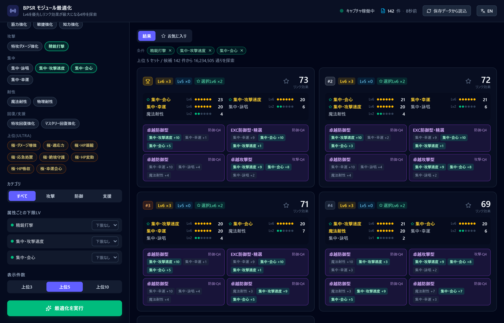
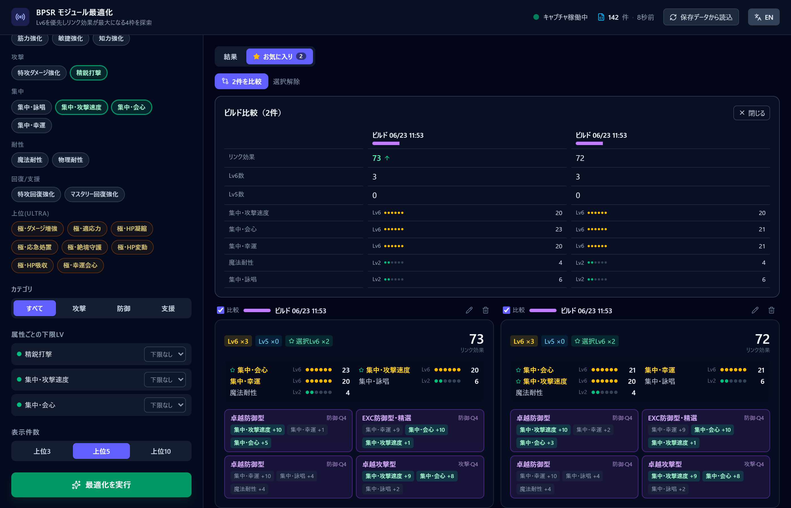

# bpsr-module-optimizer

**[日本語](./README.md) | [English](./README.en.md)**

**Blue Protocol: Star Resonance（星痕）向け モジュール最適化ツール (Windows 専用)**

[](https://github.com/Rererr/bpsr-module-optimizer/releases)
[](./LICENSE)
[](https://github.com/Rererr/bpsr-module-optimizer/releases)

[](https://discord.gg/exU3gPBx3)

所持しているモジュールの中から、**狙った属性が一番伸びる 4 枠の組み合わせ**を総当たりで探し出します。所持モジュールはゲーム通信から自動で読み取るため、手入力は不要です。**外部サーバへのデータ送信は一切ありません。**

<p align="center">
  
  <br><sub>所持モジュールから「狙った属性が最も伸びる 4 枠」を総当たりで提示（この例では候補 142 件・1,600 万通り超を探索）</sub>
</p>

> 個人利用向けの補助ツールです。ゲームファイル・メモリ・通信内容のいずれも改変しません。利用は自己責任で、各サービスの利用規約を確認してください。

## 主な機能

- **4 枠の全探索** — 所持モジュールから 4 枠の組み合わせをすべて比較し、最良のセットを提示
- **目標 / 除外属性の指定** — 伸ばしたい属性をクリックで選択（もう一度押すと除外指定）
- **属性ごとの下限 Lv 指定** — 「この属性は最低 Lv5 以上」のような条件で絞り込み
- **カテゴリ絞り込み** — 攻撃 / 守護 / 補助のモジュール種別でフィルタ
- **上位 3 / 5 / 10 件の表示** — 各セットの Lv6 数・Lv5 数・全属性レベル内訳・リンク効果（全属性値の合計）を一覧表示
- **プリセット** — よく使う検索条件に名前を付けて保存し、ワンクリックで呼び出し
- **お気に入りビルド** — 気に入った 4 枠構成を ★ で保存。名前を付けて管理でき、複数ビルドを並べて比較可能
- **ビルド比較** — お気に入りから 2〜3 件を選んで属性の差分を並列表示
- **条件サマリー** — 現在の検索条件をタグで表示。タグの × からその場で解除して再探索
- **ライブ自動取得＆自動再探索** — モジュール情報が更新されると自動で読み込み、条件指定済みなら自動で再探索
- **状態の自動復元** — 取得したモジュールと最後の検索条件を保存し、次回起動時に復元
- **JSON ダンプ読み込み** — 通信を取得できない環境向けに `owned_modules.json` からの読み込みにも対応
- **日本語 / 英語表示** — ヘッダのトグルで日本語・英語を切り替え（再起動不要）

## スクリーンショット

<p align="center">
  
  <br><sub>お気に入りに保存した複数ビルドを並べ、属性レベルの差分を比較</sub>
</p>

## インストール

1. [Releases](https://github.com/Rererr/bpsr-module-optimizer/releases) から最新の NSIS インストーラ（`.exe`）をダウンロードします。
2. インストーラを実行してアプリをインストールします。
3. アプリを起動します。ライブ取得には管理者権限が必要なため、起動時に UAC が表示されたら許可してください（自動で管理者権限へ昇格します）。

### 動作要件

- Windows 10 / 11 (x64)
- ライブ取得には管理者権限（WinDivert カーネルドライバのロードに必要）

ライブ取得では [WinDivert](https://www.reqrypt.org/windivert.html) を使ってパケットを読み取ります。`WinDivert.dll` と `WinDivert64.sys` はインストーラに同梱され、アプリ本体と同じ場所に配置されます。

## 使い方

1. アプリを起動します（UAC でゲーム同様に管理者権限を要求します）。
2. ゲーム内で**マップ移動または再ログイン**を行うと、所持モジュールが自動で読み込まれます。
3. 左側で**伸ばしたい属性**を選び、必要に応じて下限 Lv・カテゴリ・表示件数を指定します。
4. 「最適化を実行」を押すと、上位のセットがカードで表示されます。
5. 気に入ったセットは ★ で**お気に入り**に保存できます。よく使う条件は**プリセット**として保存しておくと便利です。

> 一度取得したモジュールと検索条件は自動保存されるため、次回起動時はそのまま結果を確認できます。

## 安全性・プライバシーについて

本ツールに対するよくある懸念に回答します。

### このツールを使うと BAN されますか?

**ゲーム側ファイル・メモリ・通信内容のいずれも改変しません。** 受信パケットを受動的に観測して所持モジュール情報を再構築しているだけで、ゲームクライアントへの注入・パッチ・自動操作は一切行いません。

ただし、本ソフトウェアは**個人開発の非公式ツール**であり、運営の規約変更により将来的に黙認されなくなる可能性は否定できません。**最終的な使用判断は利用者ご自身の責任でお願いします。**

### ウイルスではないですか? ウイルス対策ソフトに検出されました

**誤検知です。** カーネルレベルでパケットをキャプチャする [WinDivert](https://www.reqrypt.org/windivert.html) ドライバを同梱しているため、一部のウイルス対策ソフトが「ネットワーク監視ツール」として警告を出すことがあります。

例えば VirusTotal では Kaspersky が `Not-a-virus:HEUR:RiskTool.Multi.WinDivert.gen` と表示することがありますが、これは同梱の WinDivert ドライバを「リスクツール（ネットワークツール）」として分類しているもので、**マルウェアではありません**（検出名の先頭が `Not-a-virus` であることに注目してください）。

対処:
- WinDivert ドライバ（`WinDivert.dll`, `WinDivert64.sys`）およびインストールフォルダをウイルス対策ソフトの除外設定に追加してください。
- 不安な場合は[ソースコード](https://github.com/Rererr/bpsr-module-optimizer)を確認し、自分で[ビルド](#開発--ビルド)することも可能です（GPL-3.0）。

### Windows SmartScreen で「WindowsによってPCが保護されました」と表示されます

新規アプリはレピュテーション（実行実績）が蓄積されるまで SmartScreen 警告が表示されることがあります。

回避手順:
1. ダイアログの「詳細情報」をクリック
2. 表示された「実行」ボタンをクリック

### 外部にデータを送信しますか?

**送信しません。** テレメトリ・アナリティクス・クラッシュレポートの自動送信は一切行わず、すべての処理はローカルで完結します。

## 最適化の基準

候補になる 4 枠の組み合わせを、次の優先順位で比較します。

1. 選択した目標属性が Lv6 に到達した数
2. 全属性の Lv6 数
3. 全属性の Lv5 数
4. 全属性レベルの合計
5. リンク効果（全属性値の合計）

属性レベルは、属性値の合計が `1 / 4 / 8 / 12 / 16 / 20` に到達するごとに Lv1〜Lv6 として扱います。

## JSON ダンプの読み込み

ライブ取得を使わない場合は、`owned_modules.json` を読み込めます。

- 既定では、アプリの実行ファイルと同じディレクトリにある `owned_modules.json` を起動時に読み込みます。
- 環境変数 `BPSR_MODULE_DUMP` を指定すると、そのパスの JSON を読み込みます。
- アプリ内の再読み込み操作で、現在のダンプ内容を反映できます。

## トラブルシューティング

| 症状 | 対処 |
| --- | --- |
| モジュールが取得されない | 管理者権限で起動しているか確認。ゲーム内でマップ移動または再ログインを実行。VPN や ping reducer（ExitLag / NoPing 等）を有効にしている場合は無効化して再試行。 |
| ウイルス対策ソフトに検出される | [上記項目](#ウイルスではないですか-ウイルス対策ソフトに検出されました)を参照。 |
| 起動しない / すぐ終了する | `WinDivert.dll` と `WinDivert64.sys` がアプリ本体と同じフォルダにあるか確認（インストーラ版は自動同梱）。 |
| 「候補が 4 件未満」と表示される | 除外属性やカテゴリ・下限 Lv の条件を緩めてください。 |

不具合報告・要望は [Issues](https://github.com/Rererr/bpsr-module-optimizer/issues) または [Discord](https://discord.gg/exU3gPBx3) へお寄せください。

## 開発 / ビルド

前提:

- [Rust](https://rustup.rs/) stable
- [Node.js](https://nodejs.org/) 20 以上
- Windows でライブ取得を試す場合は管理者権限

```bash
npm install
npm run tauri dev      # 開発実行
npm run tauri build    # NSIS インストーラを作成
npm run build          # フロントエンドのみビルド
```

Rust 側の確認:

```bash
cd src-tauri
cargo check
```

### 構成

- `src/`: React フロントエンド
- `src-tauri/`: Tauri アプリ本体、最適化 API、ライブ取得連携
- `bpsr-core/`: パケット取得・解析などの共通ロジック

### 仕組み（技術的な詳細）

- ゲームの `WorldEnterSnapshot` に含まれる所持アイテムとモジュール情報を読み取ります。
- `item_package` 内でモジュール属性（`mod_new_attr.mod_parts`）を持つアイテムを抽出します。
- `mod.mod_infos[key].init_link_nums` と突き合わせて、属性 ID と属性値を復元します。
- 属性名とモジュール種別名は、日本語表示用のローカライズデータを使って表示します。

## 関連プロジェクト

- [bpsr-checker](https://github.com/Rererr/bpsr-checker) — 同じゲーム向けの軽量 DPS チェッカー（同作者）

## 支援

開発の継続を支援したい場合は、[GitHub Sponsors](https://github.com/sponsors/Rererr) からサポートできます。

## ライセンス

本ソフトウェアは [**GNU General Public License v3.0 only (GPL-3.0-only)**](./LICENSE) の下で配布されます。

- 改変版を配布する場合は、ソースコードを同じ GPL-3.0 ライセンスで公開する必要があります。
- 著作権表示・ライセンス全文・改変内容の明示を保持してください。

### 免責事項

本ソフトウェアは現状のまま提供され、**明示または黙示を問わずいかなる保証もありません**。本ソフトウェアの使用または使用不能から生じる一切の損害について、作者は責任を負いません。利用は自己責任でお願いします。

## クレジット

- [WinDivert](https://www.reqrypt.org/windivert.html): パケット取得に使用。WinDivert は GNU Lesser General Public License（LGPL）で提供されています。

ゲーム内名称や関連する権利は各権利者に帰属します。本ツールは非公式のファンメイドツールであり、ゲーム運営とは関係ありません。
